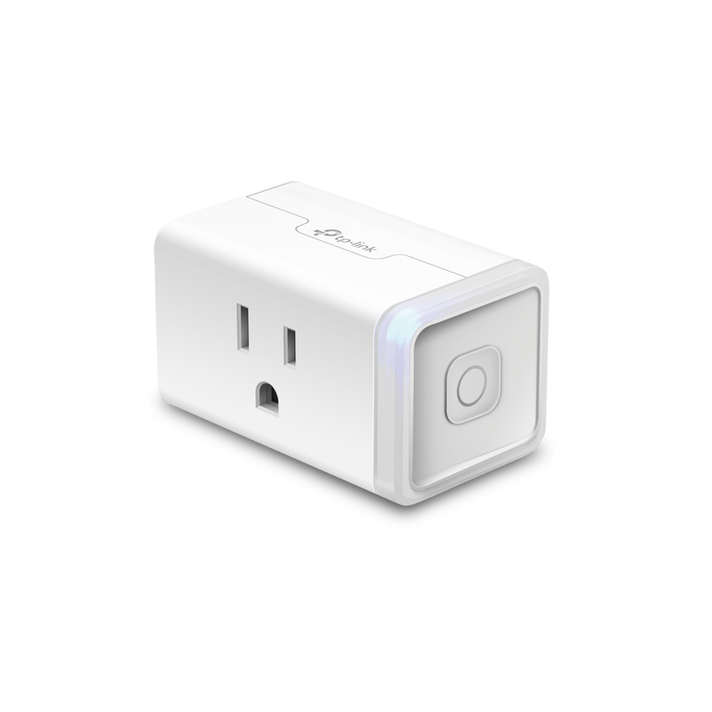

.. _kasa:

TP Link Kasa Smart Plug
=======================

MaasPower is compatible with TP-Link Kasa Smart Plugs, which provide remote switchable 
power sockets that can be used to control power switching on any machine.

Setting Up the Kasa Smart Plug
------------------------------

To use a Kasa Smart Plug, follow these steps to set it up and integrate it with MaasPower:

1. **Installation and Registration:**
   
   - Install the Kasa Smart App on your smartphone.
   - Create an account and follow the app instructions to connect your smart plug to your WiFi network.

2. **Device Control Setup:**

   - Once the device is set up in the Kasa app, you can control it directly via the app. 
   However, to control it through MaasPower, you will need to interact with it via the python-kasa library.

3. **Installing python-kasa:**

   - Ensure your system where MaasPower is installed has Python installed. MAASPower will install this 
   as part of it's dependendencies.
   - If you prefer to install this yourself, you can install the python-kasa library using pip:

     .. code-block:: bash

        pip install python-kasa

4. **Discovering Your Device:**

   - To discover your Kasa devices and get their IP addresses, you can use the `discover` command from python-kasa:

     .. code-block:: bash

        python -m kasa discover

5. **Configure MaasPower:**

   - Add a new device entry for each of your Kasa Smart Plugs in the MaasPower configuration file. 
   You need the IP address found in the previous step.

     .. code-block:: yaml

        - type: KasaDevice # Device Type, needs to be KasaDevice
          name: server01_plug # Friendly name, will be used in MAAS webhook url
          ip_address: 192.168.x.xxx # Whatever the ip address is of your smart plug

Testing Your Setup
------------------

Once you have configured your Kasa Smart Plug in MaasPower, you can test controlling the device 
through a simple command line request. For example:

.. code-block:: bash

    curl --user username:password http://your.server.ip:port/maaspower/office-plug/query

This command should return the current power state of the smart plug, verifying that your setup is correct and operational.

Note: Replace `username:password`, `your.server.ip`, and `port` with your actual MaasPower server credentials and address.

Documentation and Support
-------------------------

For more information on configuring and troubleshooting TP-Link Kasa devices with python-kasa, refer to the official python-kasa documentation:
https://python-kasa.readthedocs.io/

If you encounter issues or have questions regarding the setup with MaasPower, consider visiting the MaasPower GitHub repository or contacting support through the project's channels.

Known Issues
-------------------------
As of this writing, there are known errors with the implementation of the kasa smartdevice.py package in the python-kasa project.
This does not affect the actual control of the device like turning it on and off as well as the query function. However, the devices
won't auto update their power status when turning it on or off. Simply query the power state after toggling the power to update it.